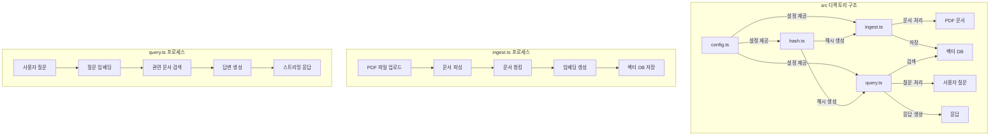

```mermaid
graph TD
    subgraph "src 디렉토리 구조"
        A[config.ts] -->|설정 제공| B[ingest.ts]
        A -->|설정 제공| C[query.ts]
        A -->|설정 제공| D[hash.ts]
        
        B -->|문서 처리| E[PDF 문서]
        B -->|저장| F[벡터 DB]
        
        C -->|질문 처리| G[사용자 질문]
        C -->|검색| F
        C -->|응답 생성| H[응답]
        
        D -->|해시 생성| B
        D -->|해시 생성| C
    end

    subgraph "ingest.ts 프로세스"
        I[PDF 파일 업로드] --> J[문서 파싱]
        J --> K[문서 청킹]
        K --> L[임베딩 생성]
        L --> M[벡터 DB 저장]
    end

    subgraph "query.ts 프로세스"
        N[사용자 질문] --> O[질문 임베딩]
        O --> P[관련 문서 검색]
        P --> Q[답변 생성]
        Q --> R[스트리밍 응답]
    end
```
