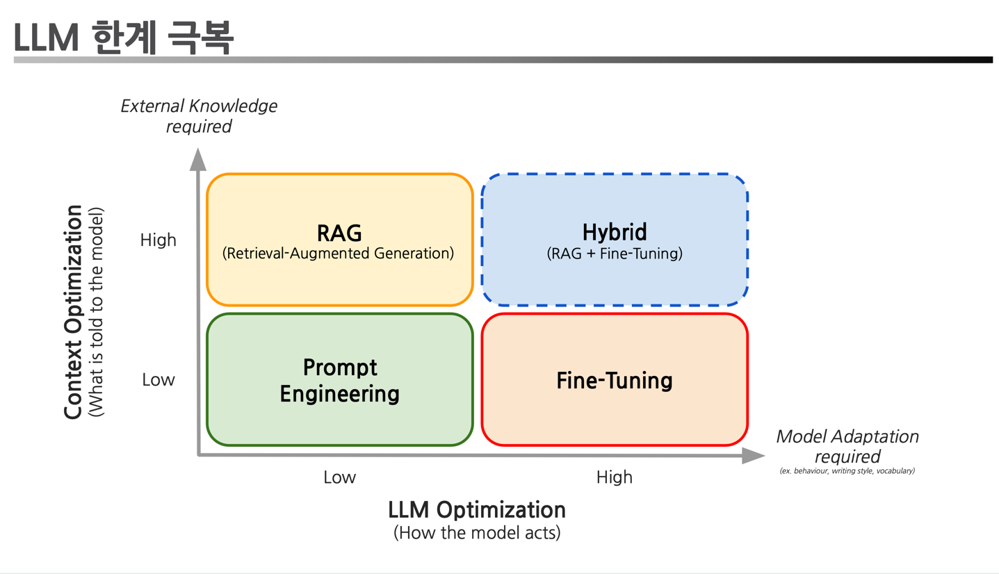
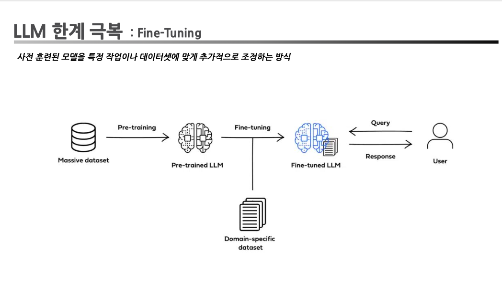
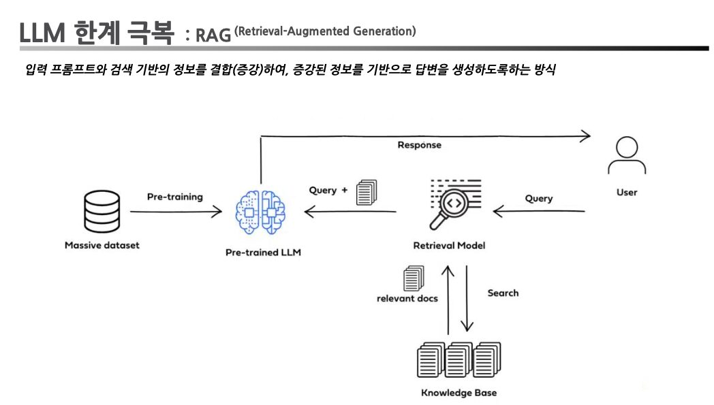
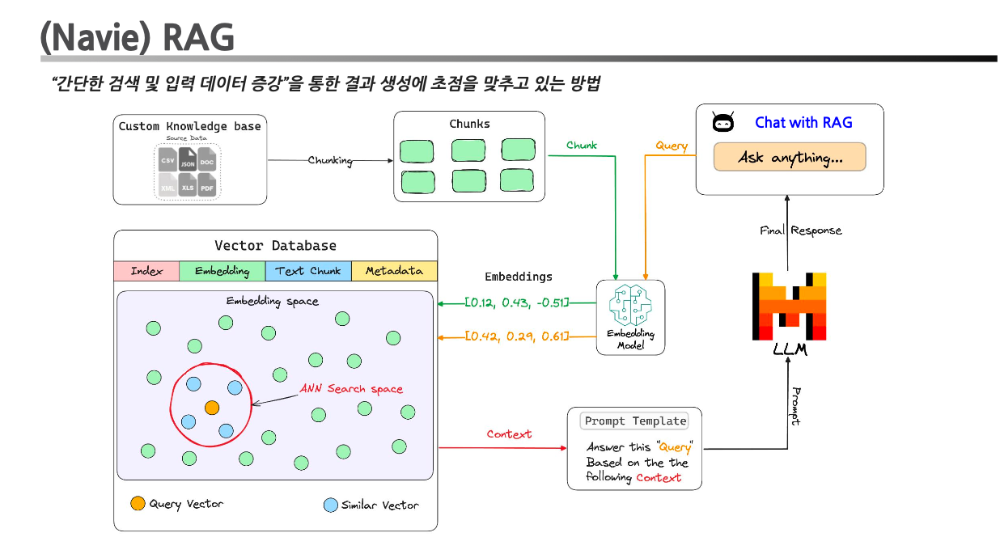

# RAG 이해하기
* LLM 에게 지식을 전달하고 가르치려면 어떻게 해야할까?

  * LLM의 한계
    * 환각 (Hallucination)
    * 오래된 정보 (Outdated information)
    * 지식을 매개변수화(parameterizing knowledge)하는 데 효율성이 낮음 •전문 분야에 대한 심층적인 지식이 부족함
    * 약한 추론 능력
  * 실제 요구 사항
    * 도메인별 정확한 답변
    * 빈번한 데이터 업데이트
    * 생성된 콘텐츠의 추적성 및 설명성 •통제 가능한 비용
    * 데이터의 개인정보 보호
* 파인튜닝 vs. RAG
| 항목                              | RAG                                                                                 | Fine-tuning                                                                                |
|---------------------------------|-------------------------------------------------------------------------------------|-------------------------------------------------------------------------------------------|
| **성능 및 지식 업데이트**         | 외부 지식베이스 실시간 조회로 최신 정보 유지, 별도 재교육 불필요                                    | 모델 자체에 추가 학습을 통해 성능·지식 고정, 새 데이터 반영 시마다 재교육 필요                      |
| **외부 지식 활용 및 데이터 처리** | 문서·DB 등 구조적·비구조적 자료 접근 최적화, 전처리·정제 부담이 적음                              | 고품질 훈련 데이터 큐레이션 필요, 제한된 데이터로는 성능 향상 폭 제한                             |
| **모델 커스터마이제이션**         | 정보 검색 중심으로 작문 스타일·행동 완전 제어 어려움                                          | 특정 톤·용어·도메인 지식 반영 가능, LLM의 스타일·응답 방식 세밀 조정 가능                         |
| **해석 가능성**                   | 각 응답의 출처(traceability) 제공으로 투명성 높음                                         | 내부 매개변수 변화가 블랙박스 여전해, 왜 그렇게 반응하는지 명확하지 않음                             |
| **컴퓨팅 자원 및 대기 시간**      | 인덱싱·검색 전략에 추가 리소스 필요, 외부 연동 유지관리 부담, 검색 과정으로 인한 지연 발생             | 한 번 학습된 후 검색 없이 즉시 응답해 저지연, 그러나 미세 조정 과정에서 상당한 연산 자원 소모             |
| **환각(Hallucination) 감소**      | 외부 증거 기반 응답으로 잘못된 정보 생성 가능성 낮음                                      | 도메인 데이터로 학습 시 환각 감소 가능, 하지만 낯선 입력에는 여전히 환각 위험                         |
| **윤리·개인정보 이슈**            | 외부 DB 저장·검색 과정에서 프라이버시·저작권 문제 발생 가능                                 | 민감한 훈련 데이터 포함 시 모델에 개인정보가 남아 노출 위험                                         |
  * LLM에게 파인튜닝이란 어떤 뜻일까?
  
  * LLM에게 RAG란 어떤 뜻일까?
  
  
## 관련 자료
* https://brunch.co.kr/@ywkim36/146
* https://deci.ai/blog/fine-tuning-peft-prompt-engineering-and-rag-which-one-is-right-for-you/